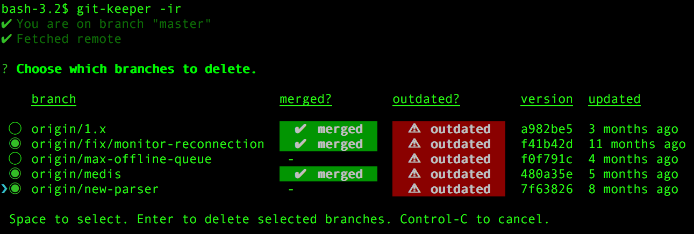

# git-keeper [](https://www.npmjs.org/package/git-keeper)
> Check for merged or outdated local or remote git branches

Helps you to keep your local and remote branches clean of merged and outdated stuff.



## Install

```bash
$ npm i -g git-keeper
```

## Requirements

* node >= 4
* git >= 2.0.0 (tested on git 2.6.3 on mac)

## Features

* Check if on master and stop if not (unless you `--force`)
* If `--remote`
  * Fetch remote 
  * Prune stale references (unless you `--skip-prune`)
* List all branches that are merged or outdated 
* **If in `--interactive` mode, you can choose which branches to delete**

## Usage

```bash
$ git-keeper <options>

Options
  -i, --interactive    Interactive mode
  -s, --skip-prune     Skip pruning remote branches
  -r, --remote         Check remote branches
  -f, --force          Force continuation if not on master branch
  -d, --days <n>       Days before branches are outdated (default: 30)

Examples
  $ git-keeper         # See which local branches are merged or outdated
  $ git-keeper -r      # See which remote branches are merged or outdated
  $ git-keeper -i      # Interactively choose local branches to remove 
  $ git-keeper -ir     # Interactively choose remote branches to remove 
  $ git-keeper -d 10   # Show branches as outdated when they are at least 10 days old 
```

## Inspiration

* [npm-check](https://github.com/dylang/npm-check) - Idea translated to git repositories, also kindly borrowed some of its code.

## License
MIT License (MIT)

Copyright (c) 2016 Michael Dreher, contributors.

Permission is hereby granted, free of charge, to any person obtaining a copy of this software and associated documentation files (the "Software"), to deal in the Software without restriction, including without limitation the rights to use, copy, modify, merge, publish, distribute, sublicense, and/or sell copies of the Software, and to permit persons to whom the Software is furnished to do so, subject to the following conditions:

The above copyright notice and this permission notice shall be included in all copies or substantial portions of the Software.

THE SOFTWARE IS PROVIDED "AS IS", WITHOUT WARRANTY OF ANY KIND, EXPRESS OR IMPLIED, INCLUDING BUT NOT LIMITED TO THE WARRANTIES OF MERCHANTABILITY, FITNESS FOR A PARTICULAR PURPOSE AND NONINFRINGEMENT. IN NO EVENT SHALL THE AUTHORS OR COPYRIGHT HOLDERS BE LIABLE FOR ANY CLAIM, DAMAGES OR OTHER LIABILITY, WHETHER IN AN ACTION OF CONTRACT, TORT OR OTHERWISE, ARISING FROM, OUT OF OR IN CONNECTION WITH THE SOFTWARE OR THE USE OR OTHER DEALINGS IN THE SOFTWARE.

Screenshots are [CC BY-SA](http://creativecommons.org/licenses/by-sa/4.0/) (Attribution-ShareAlike).
